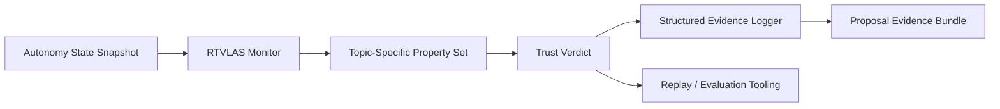

# Architecture

This repository adapts RTVLAS for **DAF26BZ01-NV008 Runtime Assured Autonomy**.

## System Role

**Opening angle:** black-box autonomy fault monitor; trust/health/proof layer; mitigation-supervisor hooks

## Runtime Elements

- `core/`: monitor, property framework, evidence writer
- `bindings/`: C ABI for external autonomy stacks
- `tooling/replay/`: deterministic replay of autonomy traces
- `tooling/eval/`: scenario evaluator and artifact generation
- `evidence/`: pre-generated scenario outputs for reviewers

## Topic Adaptation

The property set in this repository is tuned for:

- Path Command Feasibility
- Flight Corridor Containment
- Temporal Coherence
- Mission Solution Validity
- Mission Solution Quality
