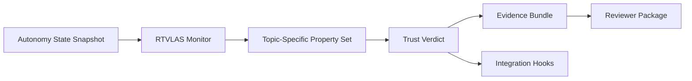

# Technical Volume

## 1. Technical Thesis

The proposal opens with the following angle: **black-box autonomy fault monitor; trust/health/proof layer; mitigation-supervisor hooks**.

RTVLAS is not proposed here as the primary autonomy engine. It is proposed as the supervisory runtime layer that determines when autonomy outputs should no longer be trusted. That positioning is well matched to the current submission posture because it focuses on interface definition, safety property construction, and low-order scenario evidence rather than expensive airworthiness-scale integration.

## 2. Solicitation-Specific Fit

**Track posture:** Phase I

**Objective fit:** Develop runtime assured autonomy functions that monitor black-box autonomy outputs, determine when COAs are infeasible, incorrect, or non-optimal, and activate mitigation or reversionary behaviors.

This repository is explicitly shaped around the following solicitation needs:

- black-box fault detection and isolation for autonomy-generated COAs
- platform and fleet safety checks such as corridor compliance and path feasibility
- performance monitoring for correct and optimal mission execution under contingencies
- mitigation hooks for loiter, reversionary autonomy, return-to-base, or ditch logic

**Deliberate scope boundary:** This repository deliberately focuses on runtime COA trust assessment and mitigation triggers rather than replacing the underlying flight or mission autonomy stack.

## 3. Problem

Air Force autonomy programs need a low-compute runtime layer that can determine when nondeterministic autonomy is generating unsafe, infeasible, or mission-degrading outputs without requiring full white-box access to the autonomy internals.

## 4. Proposed Solution

RTVLAS adapted as a black-box runtime assurance module that monitors autonomy outputs, detects infeasible or degraded decisions, and exports signed evidence for recovery and certification support.

The prototype consists of:

- a Rust runtime monitor that ingests autonomy state snapshots
- a property framework that evaluates topic-specific trust rules
- a structured evidence logger that writes JSON scorecards and human-readable proof logs
- replay and evaluation tooling for deterministic verification
- a C ABI that supports integration with existing autonomy stacks written in C or C++

## 5. Architecture

## 6. Topic-Specific Safety / Trust Properties

- **Path Command Feasibility**: Ensures commanded speed remains within the certified safe maneuver envelope for the current platform state.
- **Flight Corridor Containment**: Detects path plans that drive the vehicle outside its assigned flight corridor or deconflicted airspace lane.
- **Temporal Coherence**: Bounds autonomy timing skew so stale or reordered decisions do not silently propagate through the mission loop.
- **Mission Solution Validity**: Checks whether the autonomy stack itself still marks the current course of action as feasible after contingency updates.
- **Mission Solution Quality**: Tracks whether the autonomy output has degraded below the minimum acceptable mission-quality threshold even if still technically feasible.

## 7. Preliminary Feasibility Evidence

This repository includes three deterministic scenarios that exercise both nominal and non-nominal behavior:

- **Nominal Sortie**: Baseline autonomy behavior with coherent timing, corridor adherence, and feasible command outputs.
- **Degraded Contingency Handling**: Autonomy remains online but begins producing slightly stale and lower-quality solutions during a contingency replan.
- **Faulty Autonomy Chain**: The autonomy stack emits infeasible commands and departs the assigned corridor, driving a hard reject verdict.

For each scenario, the package generates:

- `trust_scorecard.json`
- `timeline.json`
- `proof_log.txt`
- `trace.svg`

These artifacts provide preliminary data supporting the claim that the monitor can detect degraded or unsafe autonomy behavior while preserving a replayable evidence trail.

## 8. Differentiators

- low-compute runtime implementation in Rust
- clear C ABI for autonomy-stack integration
- property-based monitoring rather than opaque post hoc anomaly scoring
- deterministic replay and evidence regeneration
- direct claim-to-artifact traceability for reviewers

## 9. Execution Posture

The immediate objective is to mature this repository from a topic-tuned software prototype into a reviewer-verifiable package that defines architecture, interfaces, monitoring rules, evidence products, and a concrete path to next-phase integration.

## 10. End State

A reusable runtime assurance software layer that can be integrated into ACP mission stacks as a black-box supervisor and evidentiary trust layer.

## 11. Transition Path

Integrate with surrogate UAS mission software aligned to A-GRA, port to companion compute targets, and demonstrate real-time mitigation hooks in SIL/HIL environments.
